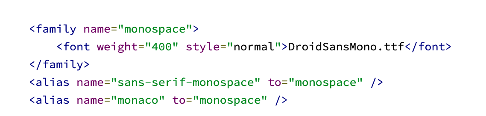
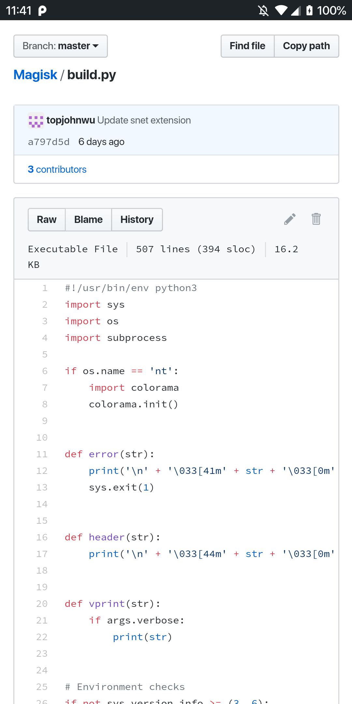
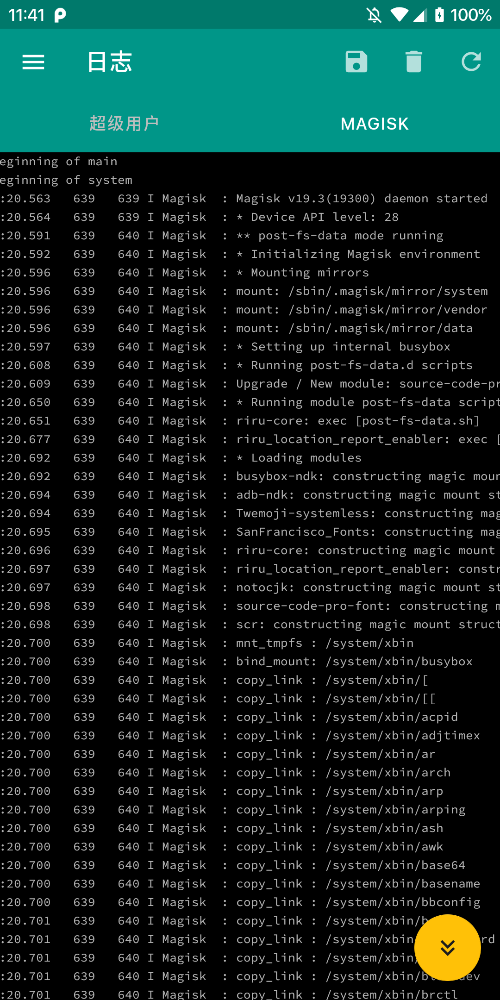
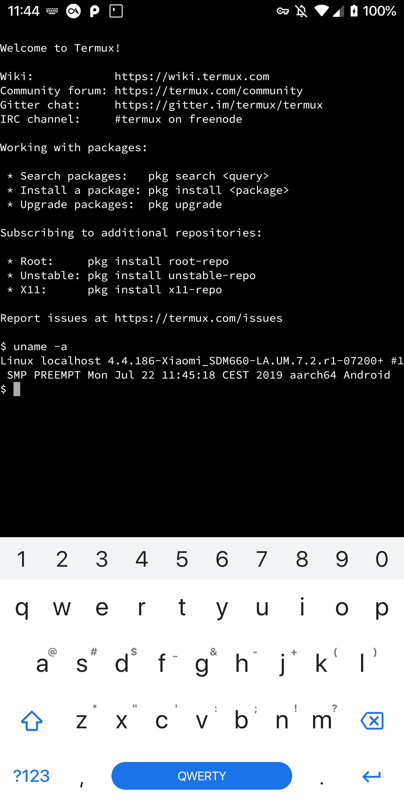
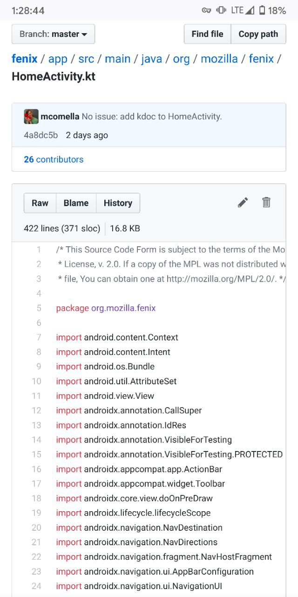
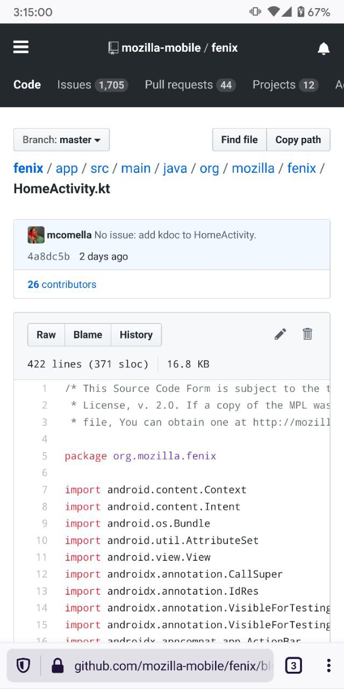

# Source Code Pro font for Android

 

## Introduction

[Source Code Pro](https://fonts.adobe.com/fonts/source-code-pro) is a `monospaced` font family for user interface and coding environments. Its simplicity and clearness always attract people to love and enjoy it. There are a lot of people like me who prefer the font in editors, IDEs, and browsers. So why not try it out on Android? This module just help you do that with the art of Magisk: **keep the system actually untouched.**

## Details about this module

- Font file are renamed from with Adobe's latest [release](https://github.com/adobe-fonts/source-code-pro/releases/tag/2.030R-ro%2F1.050R-it) of non-variable Source Code Pro font(`Roman 2.030`).
- For monospaced font, Android supports one font weight and one font style by default:
  
  Considering the compatibility and to make least trouble when user wants to migrate to other fonts, I give up the idea to install a modified `fonts.xml`.
- Should not conflict with other font packs. (There's now no font packs which replace the total `/system/fonts` directory I guess.)

## Installation Guide

- Using the lastest Magisk release is recommended.
- Download, flash, then reboot to enjoy it!
- **Necessary for Firefox Users:** you will have to manually set default monospace font of specific langugages in `about:config`, from `Droid Sans Mono` to `Source Code Pro`, or the font won't be rendered in Firefox. Check out the reason [here](https://github.com/mozilla-mobile/fenix/issues/9723).

## Preview

## Changelog

- Apr 6, 2020 -v1.01 (Font version 2.030 Roman)
- Aug 14, 2019 - v1.0  (Font version 1.010, Roman Variable)

## Known Issues

This problem has already been solved.  
~~Installing this module will cause that monospaced font won't be rendered in Firefox Preview. This is also reproducible on Firefox 68 for Android), and default font of the specific language (`sans-serif` or `serif`, change this in `about:config`) will be rendered instead.~~

~~When this module is enabled:~~  

~~And when it is disabled:~~  

## License

- Adobe Source Code License [SIL Open Font License 1.1
  ](https://github.com/adobe-fonts/source-code-pro/blob/release/LICENSE.txt)

- [MIT](https://github.com/moposx/Magisk-source-code-pro/blob/master/LICENSE) License for this module

## Credits

- Adobe Fonts
- Magisk Project

## Feedback and Support

- Create an issue in the [github repository](https://github.com/moposx/Magisk-source-code-pro)
- [Email me](mailto:moposx01@gmail.com)
